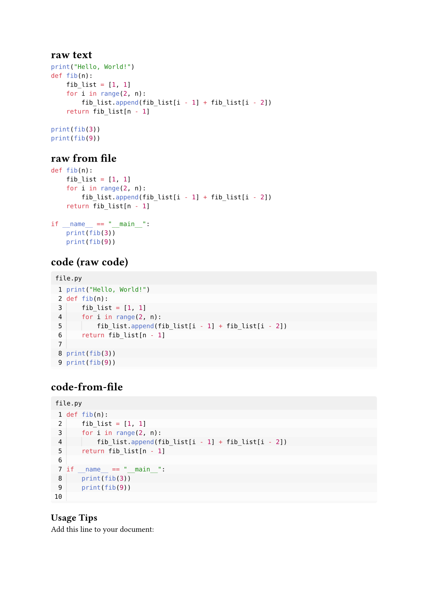

# code 1.0.0

Codeblock rendering utilities for Typst: `code`/`code-from-file` (a styled
preset over [zebraw](https://github.com/hongjr03/typst-zebraw)) and
`codedis` (adapted from
[AugustinWinther/codedis](https://github.com/AugustinWinther/codedis)).

Standalone package — not vendored, still fetches `@preview/zebraw:0.6.1`
from Typst Universe. `@atalariq/lab-report` (2.0.0+) has its own codeblock
rendering built in and doesn't need this package; `code` is kept
independently for callers that only want codeblocks, without a full report
template.



Rendered from `example/main.typ` — see that file for the full source.

## Usage

````typst
#import "@atalariq/code:1.0.0": *

#code(```py
def fib(n):
    ...
```)

#code-from-file(read("file.py"), lang: "py")

#codedis(read("file.py"), lang: "py")
````

## Exports

- `code(header:, numbering:, ..zebraw-args, raw-block)` — zebraw preset, `lang: false` by default (no language tab).
- `code-from-file(read-file, lang: "py", ..code-args)` — wraps `code()`, takes the already-`read()` file content.
- `codedis(code, lang:, font-size:, border-size:, border-color:, line-color-1:, line-color-2:, lines:, line-numbers:, line-number-color:)` — an alternative renderer with rounded per-line blocks and alternating fill, no zebraw dependency.
