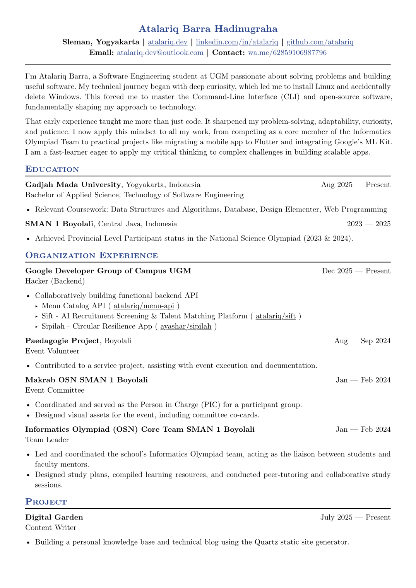

# cv 1.0.0

ATS-friendly CV/resume template. Ligatures are intentionally disabled so
Applicant Tracking Systems don't misread the font.



Rendered from `example/cv.typ` — see that file for the full source.

## Usage

```typst
#import "@atalariq/cv:1.0.0": *

#show: cv.with(
  author: "Jane Doe",
  location: "City, Country",
  email: "jane@example.com",
  github: "jane",
  linkedin: "jane",
  accent-color: "#000000",
)

= Education
#edu(
  institution: "University Name",
  ...
)
```

`cv` defaults to English (`lang: "en"`), New Computer Modern, and
`us-letter` paper.

## Exports

- `cv(author:, location:, email:, github:, linkedin:, phone:, personal-site:, accent-color:, font:, paper:, font-size:, lang:, body)` — base show rule.
- Layout helpers: `generic-two-by-two`, `generic-one-by-two`.
- Section components: `edu`, `work`, `experience`, `project`, `certificates`, `extracurriculars`.
